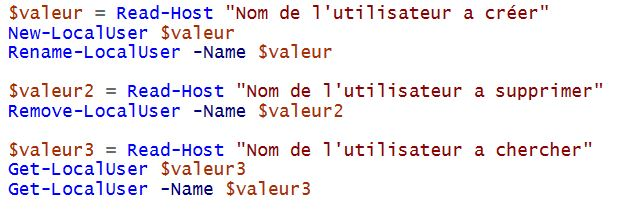

# 1 - Scripts de gestion des comptes utilisateurs

Tout d'abord pour savoir quelles commandes utiliser on va taper la commande : 
        
    - Get-Command -Module Microsoft.PowerShell.LocalAccounts
  

On voit que les commandes que l'on doit utiliser pour l'exercice sont : 

    - Créer des utilisateurs : New-LocalUser
    - Modifer des utilisateurs : Rename-LocalUser
    - Supprimer des utilisateurs : Remove-LocalUser
    - Voir utilisateurs : Get-LocalUser
    - Rechercher l'éxistence d'un utilisateur : Get-LocalUser -Name

Voici le résultat lorsqu'on éxécute le script : 

