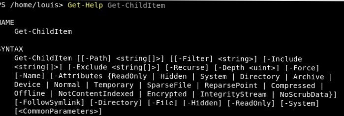
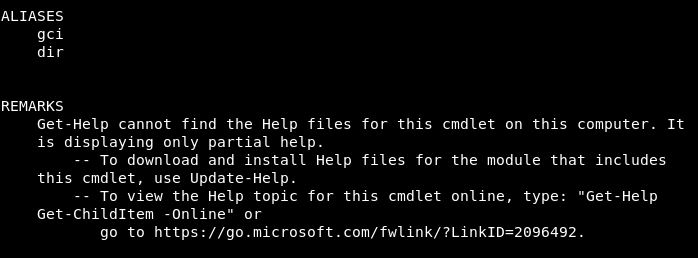
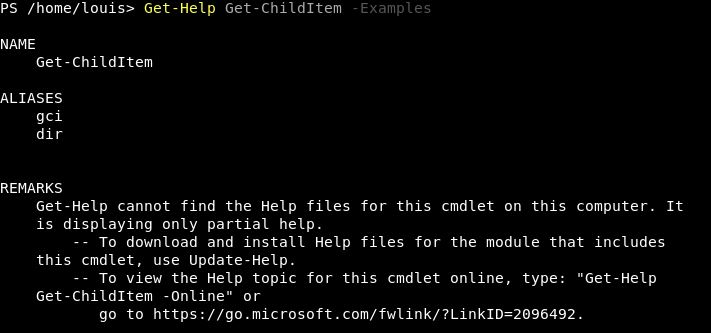
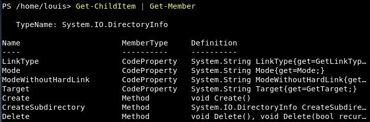

# Aide commandes 

## Commmandes pour obtenir de l'aide 
***
### Afficher de l'aide sur une commande : 
    
    - Get-Help **Commande**
  
  exemple : 
    

Lorsque l'on tape cette commande on nous affiche 3 choses : la **syntaxe** à utiliser, les **alias** (raccourcis) disponibles et des **remarques** sur la commande. 
***
### Afficher les exemples : 
     - Get-Help **Commande** -Examples

    
exemple : 

    Idem que pour l'aide, la **syntaxe**, les **alias** et les **remarques** s'affichent.

### Afficher la liste des méthodes et des propriétés des objets : 
    - **Commande** | Get-member
    

