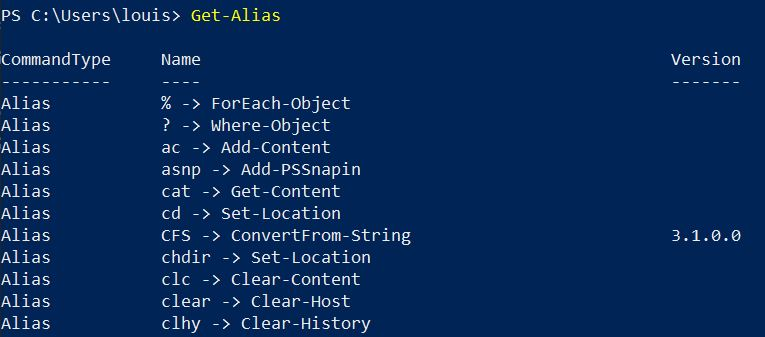

# Alias 

#### Afficher tout les Alias disponible
    - Get-Alias

#### Créer ses propres raccourcis 
    - Set-Alias -Name 'c' -Value 'clear'
    - (Les valeurs entre '' dépendent de ce que vous choisissez)

*** 

[Sommaire](README.md) / Précédent :[Gérer les fichiers et dossiers](commandes.md) / Suivant : [Variables](variables.md)