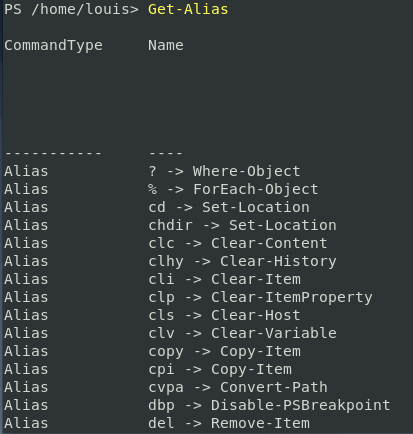
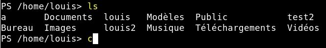

# Alias

- Afficher tout les reccorcis déja disponible : 
    - Get-Alias
    
     
    
    Cette commande nous permet de nous afficher tout les raccourcis déja créer par Powershell. Ici une petite partie de ce qui est disponible.

- Créer ses propres raccourci : 
    - Set-Alias -Name **c** -Value **clear** 
        - Exemple, la commande suivante permet de créer l'alias c vers la commande Clear :
     
    
    
    
     **Le raccourci créer fonctionne bien.**

