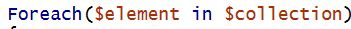
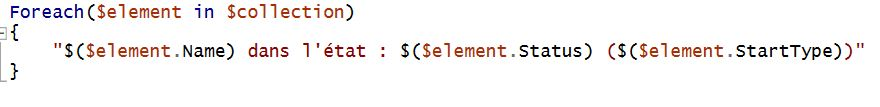
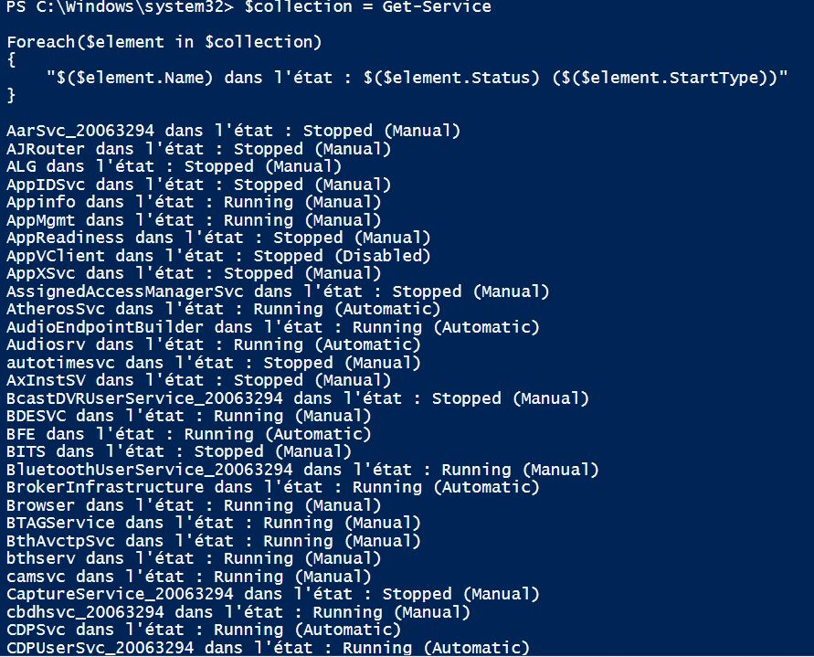
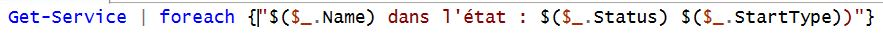

# Les boucles 

- Il y'a 2 moyens de faire des boucles : 
  - En scrpit bloc
  - Avec le pipeline 

## En script bloc 

Pour faire une boucle en script bloc on doit tout d'abord créer un collection de données. Une collection est un ensemble de valeurs. 

Ensuite, on va créer une variable qui va correspondre a chaque objet de la collection. Puis grâce au Foreach cela va parcourir chaque élément de la collection. 

Pour finir, on va créer un bloc d'instruction qui définit ce que doit afficher la boucle. 

Cela va nous afficher : 

## Avec le pipeline 

Dans ce cas la, la collection n'a pas besoin d'être déclarée car elle va directement être traitée et passée a la boucle au travers du pipeline. 

Les données seront récupérées automatiquement grâce a la variable **$_.** 

Les deux méthodes sont différentes mais le résultat est identique. 