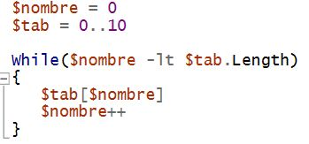
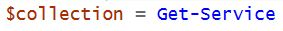
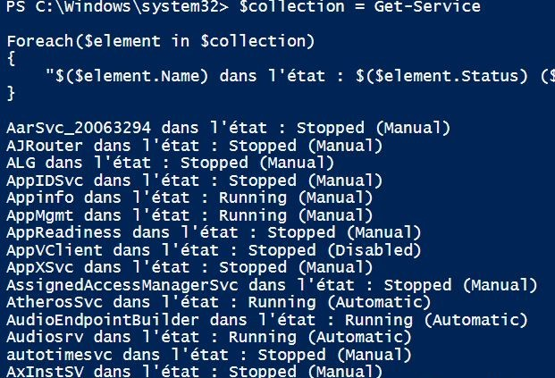

# Les boucles

Qu'est ce qu'une boucle ?

En programmation, c'est une structure de contrôle permettant d'exécuter un ensemble d'instructions de façon répétée sur la base d'une condition booléenne. 

Voici quelques exemples de boucles possible : 
***
## For

En PowerShell, la boucle "For" s'appuie sur la syntaxe suivante :

    For(<état initial>;<condition de répétition>;<incrémentation>)
    {
      <Si la condition est vraie, on exécute ce bloc d'instructions>
    }

    <Si la condition est fausse, la boucle for se termine et le script continue...>

#### Exemple  
Lorsque l'on utilise une boucle for: on indique une valeur de départ (état initial), une valeur "maximale" dans la condition de répétition et on incrémente la valeur à chaque tour de boucle (à chaque itération).

 

***
## While
La boucle while peut être considérée comme une répétition de l'instruction if.

    La boucle While fonctionne en 4 étapes : 
    1. La boucle évalue la condition.

    2. Si la condition est fausse, le bloc d’instruction n’est pas exécuté et la boucle se termine. 

    3. Si la condition est vraie, alors le bloc d’instructions est exécuté.

    4. Retour à l’étape 1.
#### Exemple 

Cette boucle est un tableau définit d'une taille de 10. Tant que le nombre n'atteint pas la taille du tableau, on ajoute 1 au nombre a chaque fois.

***
## Foreach

    - Il y'a 2 moyens de faire des boucles : 
    - En scrpit bloc
    - Avec le pipeline 

#### En script bloc 

Pour faire une boucle en script bloc on doit tout d'abord créer un collection de données. Une collection est un ensemble de valeurs. 

Ensuite, on va créer une variable qui va correspondre a chaque objet de la collection. Puis grâce au Foreach cela va parcourir chaque élément de la collection. 

Pour finir, on va créer un bloc d'instruction qui définit ce que doit afficher la boucle. 

Cela va nous afficher : 

### Avec le pipeline 

Dans ce cas la, la collection n'a pas besoin d'être déclarée car elle va directement être traitée et passée a la boucle au travers du pipeline. 

Les données seront récupérées automatiquement grâce a la variable **$_.** 

Les deux méthodes sont différentes mais le résultat est identique. 

*** 

Il existe aussi d'autre type de boucle comme les Do-until, Do-while,.... 

*** 

[Sommaire](README.md) / Précédent :[Conditions](conditions.md) / Suivant : [Scripts de gestion des comptes utilisateurs](TP/exo1.md)