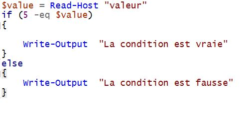
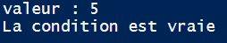
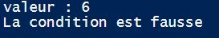

# Conditions 

Qu'est ce qu'une condition ? 

C’est ce qu’on appelle une exécution conditionnelle. Il y'a seulement deux issues.

        - Oui 
        - Non
    
On peut exprimer une condition sous plusieurs formes : 
        
        - if
        - then
        - else
        - else if 

***
#### Exemple

Ce script vérifie **si** la valeur que l'on rentre est bien égale a 5 **sinon** elle nous renvoie que la condition est fausse. 

***

[Sommaire](README.md) / Précédent :[Scripts](scripts.md) / Suivant : [Boucles](boucles.md)