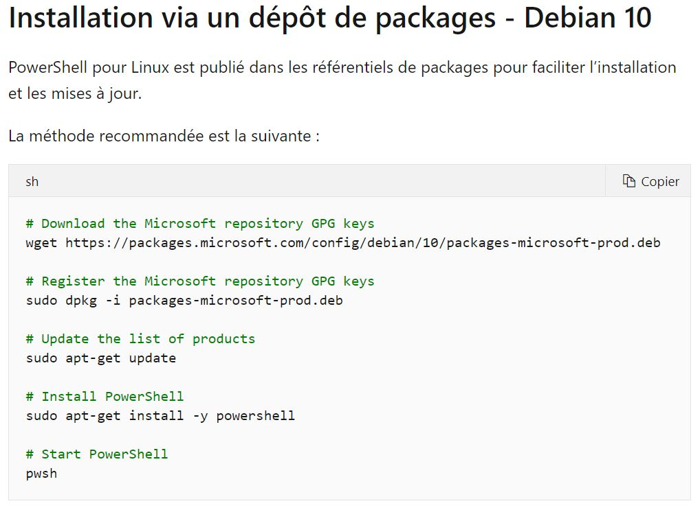
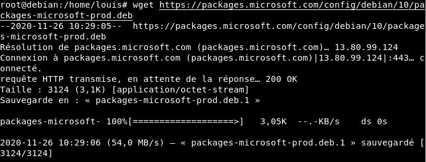
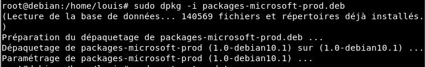
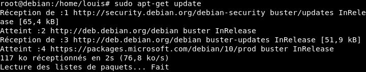
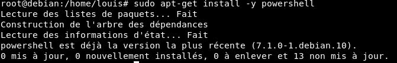
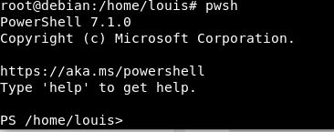

## Installation

Pour installer PowerShell sur Linux, j'ai suivi la doc de ce site [ici](https://docs.microsoft.com/fr-fr/powershell/scripting/install/installing-powershell-core-on-linux?view=powershell-7.1) 

Lorsque je voulais commencer l'installation de PowerShell sur mon utilisateur **'louis'** cela ne m'autorisait pas à effectuer l'installation car mon utilistateur n'avait pas tout les droits. Alors pour contourner le problème je suis passé par l'utilisateur **'root'** qui lui a tout les droits sur la session. 
Pour passer sur cette utilisateur, il suffit de taper la commande **'su root'** dans le terminal puis de taper le mot de passe de notre utilisateur principal. Dans mon cas le MDP de **'louis'**. 

On va suivre ces commandes. 

Lorsque les installations seront terminées, il suffira de taper **'pwsh'** pour se "mettre" sur PowerShell

