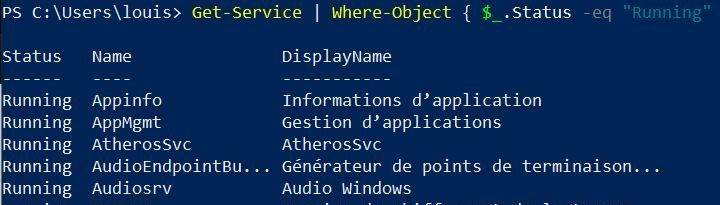

# Pipeline 
***
Dans PowerShell, le Pipeline permet de connecter deux commandes. La sortie d'une commandes sera la sortie de la suivante. Il permet par exemple d'afficher tout les programmes en cours d'execution. 
***
    - Get- Service | Where-Object { $_.Status -eq "Running" }

