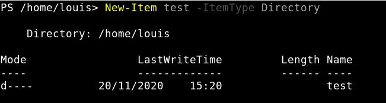

# Powershell-Linux 

## Gérer les fichiers/dossiers

Commandes : 

- Afficher le contenu d'un dossier courant : 
    - Get-Location 
    - pwd 
    
 

- Afficher le contenu d'un dossier :
    - Get-ChildItem (+ détaillé)
    - ls
    

- Créer un dossier :
    - New-Item ***nom du fichier*** -ItemType Directory 
  
  
  
  
  **On voit bien que le dossier à été créer** 

- Se déplacer dans les dossiers : 
    - Set-Location ***dossier*** 
    - cd ***dossier*** 
    - chdir ***dossier*** 
    
    

    **Avec cette commande on se retrouve dans le dossier que l'on veut** 

- Créer un fichier :
    - New-Item ***nom du fichier*** 
    - ni ***nom du fichier***
    
    
    

    **Le fichier ***test2*** à bien été créer**

- Supprimer un fichier/dossier : 
    - Remove-Item ***nom du fichier*** 
    - del ***nom du fichier*** 
    - erase ***nom du fichier*** 
    - ri ***nom du fichier***
    
    

    **Le fichier ***test2*** à bien été supprimé**

- Renommer un fichier : 
    - Rename-Item ***nom du fichier*** -NewName ***nom du fichier2*** 
    - rni ***nom du fichier***
   
    
    

    **Le fichier 'test2' à bien été renommé en 'testrename'**

- Copier un fichier : 
    - Copy-Item ***nom du fichier*** -Destination ***nom du fichier2***
    
    
    

    **Le fichier 'test' à bien été copié en 'testcopy'**

  - Déplacer un fichier : 
    - Move-Item ***nom du fichier*** -Destination ***chemin\nom du fichier*** 
    - move ***nom du fichier***
    
    
    

  

- Tester l’existence d’un fichier ou dossier : 
    - Test-Path ***chemin/nomFichier.txt***
    
