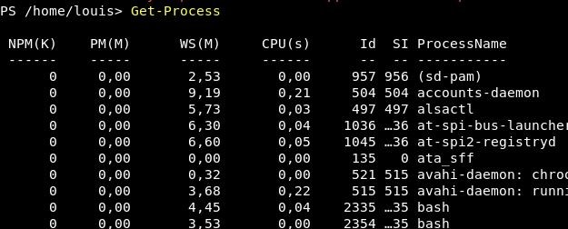
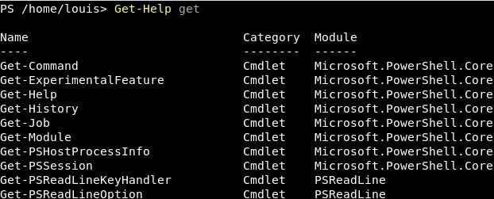
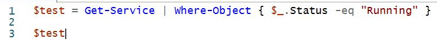
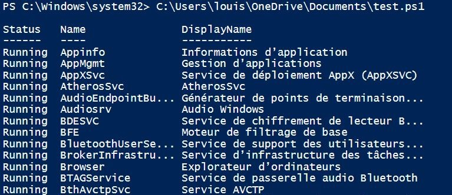

# Scripts 
***
Pour créer des scripts PowerShell on utilisera le logiciel Windows Powershell ISE 

## Préparation à l'execution de scripts PowerShell : 
    - Dans PowerShell, une politique restreint l'éxécution des scripts, on peut voir cette politique grâce a la commande **Get-ExecutionPolicy**

Dans ce cas, on est dans le "mode" **Unrestricted**. Tout les types de restrictions qui existent : 

  - Restricted — Aucun script n’est autorisé. Il s’agit du paramètre par défaut, que vous verrez donc lors de votre première exécution de la commande.
  - AllSigned — Vous pouvez exécuter les scripts signés par un développeur de confiance. Ce paramétrage vous demandera, avant l’exécution d’un script, de confirmer que vous souhaitez bien l’exécuter.
  - RemoteSigned — Vous pouvez exécuter vos propres scripts ou les scripts signés par un développeur de confiance.
  - Unrestricted — Vous pouvez exécuter tous les scripts que vous voulez.

Pour changer de restriction, il suffit de taper la commande **Set-ExectutionPolicy** ***TypeRestriction***

## Cmdlets 

- Un cmdlet est une commande PowerShell qui a une fonction prédéfinie. 

- Get — pour obtenir quelque chose
- Set — pour définir quelque chose
- Start — pour exécuter quelque chose
- Stop — pour arrêter quelque chose en cours d’exécution
- Out — pour générer quelque chose
- New — pour créer quelque chose (« new » n’est pas un verbe, mais il fonctionne comme un verbe)

Par exemple, pour afficher tout les protocoles en cours d'execution on peut taper **Get-Process** 

Pour voir tout les **cmdlets** disponible on tape Get-Help Category : 

Exemple : 

## Premier script

Voici un exemple de premier script : 
    

La première chose de ce script est de déclarer une variable ici **$test**. Cette variable va nous sortir tout les services ou "l'objet" (ici le status) est en fonctionnement ("Running"). 

Pour l'executer on doit, aller sur le fichier et cliquer sur **Executer avec Powershell**.

Le programme va alors s'executer dans PowerShell. 
    
