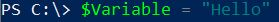
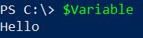
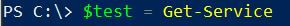
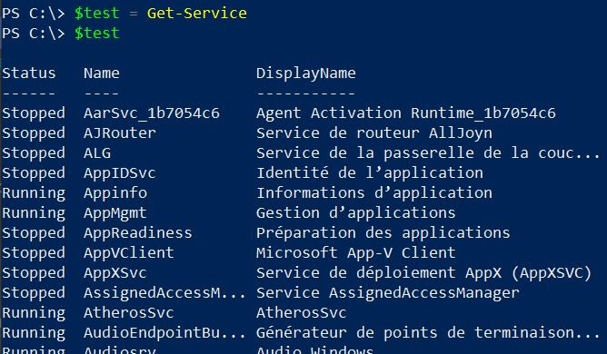

# Les variables 
***
#### Qu'est ce qu'une variable 
La variable est un concept important en programmation informatique. Intuitivement, il s'agit d'un nom qui se réfère à une chose. Informatiquement, c'est une référence à une adresse mémoire.
***
#### Les types de variables 
- **String** = Chaîne de caractères.
- **Array** = Tableau.
- **Int** = Nombre entier codé sur 32 bits. 
- **Bool** = Renvoie une valeur vrai ou faux 
- **Long** = Nombre entier codé sur 64 bits. 
- **Char** = Symbole 
- **Decimal** = Nombre décimal codé sur 128 bits.
- **Datetime** = Date et heure
- **Single** = Nombre décimal à virgule de 32 bits
- **Double** = Nombre décimal à virgule de 8 bits.
***
#### Déclarer une variable : 
    - NomVariable = 'Hello'

  - Remarque : pour savoir le type de la variable on peut taper la commande $NomVariable.GetType() pour savoir si c'est un string, un int, etc .. 

***
#### Forcer le type d'une variable : 
    - [type]$NomVariable = 'Hello' 

***
#### Stocker le résultat d'une commande dans une variable : 
    - $NomVariable = Get-Service 

*** 

[Sommaire](README.md) / Précédent :[Alias](alias.md) / Suivant : [Pipeline](pipeline.md)