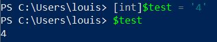
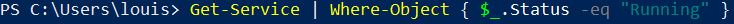
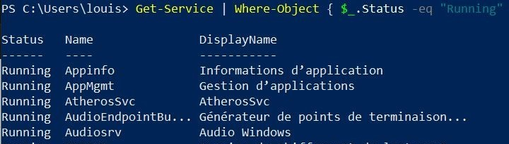

# Les variables 

- Déclarer une variable : 
  - $NomVariable = 'Hello'
  

Remarque : pour savoir le type de la variable on peut taper la commande $NomVariable.GetType() pour savoir si c'est un string, un int, etc .. 

- Forcer le type d'une variable : 
  - [type]$NomVariable = 'Hello' 

- Stocker le résultat d'une commande dans une variable : 
  - $NomVariable = Get-Service 

***
## Pipeline 

Dans PowerShell, le Pipeline permet de connecter deux commandes. La sortie d'une commandes sera la sortie de la suivante. Il permet par exemple d'afficher tout les programmes en cours d'execution. 

  - Get- Service | Where-Object { $_.Status -eq "Running" }

